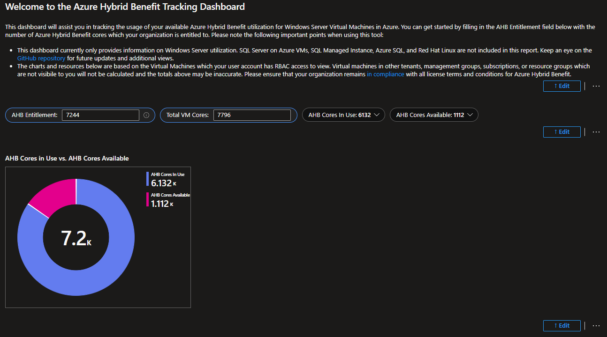

# Azure Hybrid Benefit (AHB) Tracking Workbook

## Overview

This workbook provides a centralized and practical way to track Azure Hybrid Benefit (AHB) usage for Windows Server.

This gap was originally addressed by an Azure Workbook created by Ryan Lowell. 
This version builds on that foundation and is customized to focus specifically on AHB core entitlements versus actual usage.

## Why This Workbook Matters

Azure licensing rules treat any virtual machine with fewer than 8 cores as an **8-core machine**. This means:
- A 2-core or 4-core VM still consumes 8 AHB cores
- Assigning licenses to small VMs first leads to wasted entitlements
- Optimal license assignment starts with VMs that have **8 cores or more**

Without clear visibility, it is easy to over-assign or underutilize AHB licenses.

## What This Workbook Does

This workbook:
- Calculates AHB cores in use across Windows Server VMs
- Allows manual input of total AHB core entitlement
- Automatically calculates remaining AHB cores available
- Provides a clear view of current AHB assignment status

It does **not** estimate cost. It focuses on entitlement usage and optimization visibility.

## Deployment Instructions

1. Deploy the Azure Workbook normally from the link: https://techcommunity.microsoft.com/blog/healthcareandlifesciencesblog/tracking-azure-hybrid-benefit-using-azure-workbooks/3798857
2. Open the workbook and select Edit (bottom-right corner where the visuals are shown).
3. Replace the existing JSON with the JSON file from this repository.
4. Save the workbook.

## Required Manual Input

You must manually enter your total AHB core entitlement:
- This value represents how many Windows Server cores you are licensed to use with AHB.
- In large enterprise environments, determining this number may require coordination with licensing, procurement, or asset management teams.

Once entered, the workbook will handle all calculations automatically.

## Example

In a sample environment:
- AHB Entitlement: 7,244 cores (entered manually)
- AHB Cores in Use: 6,132 cores (calculated by the workbook)
- AHB Cores Available: 1,112 cores

This immediately shows whether additional licenses can be assigned or whether optimization is required.

## Intended Audience

- FinOps practitioners
- Cloud cost and license managers
- Azure platform and governance teams
- Organizations using Azure Hybrid Benefit at scale

## Notes

- This workbook uses **Azure Resource Graph** queries.
- No agents, exports, or external tools are required.
- The workbook can be freely customized to match organizational standards and maturity.

